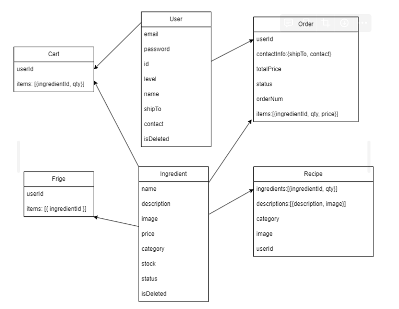
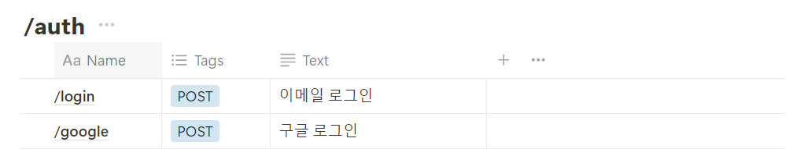
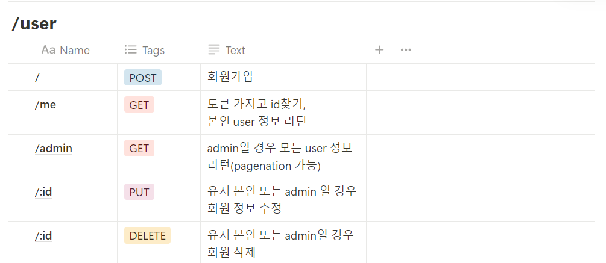
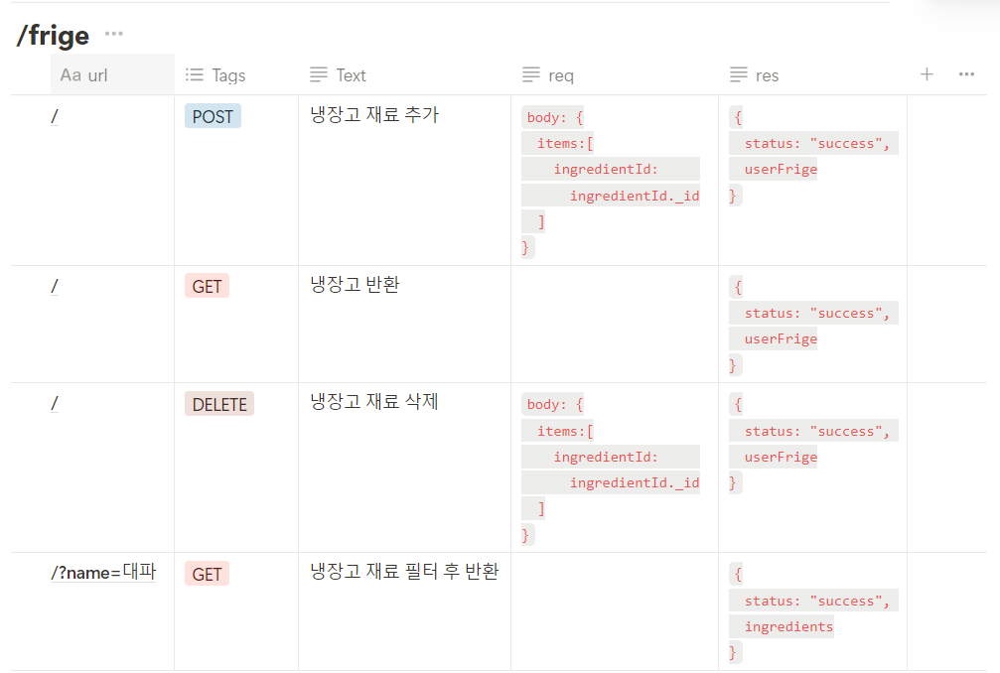
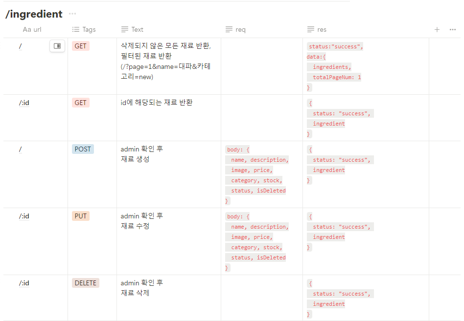
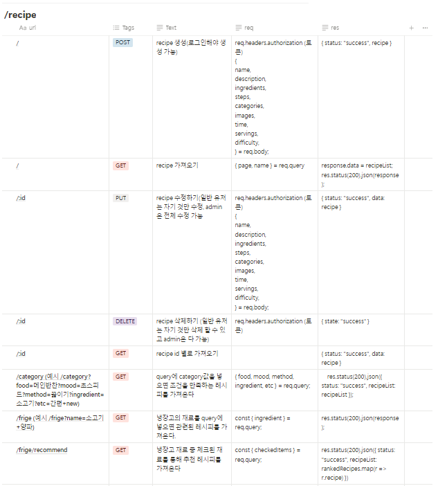
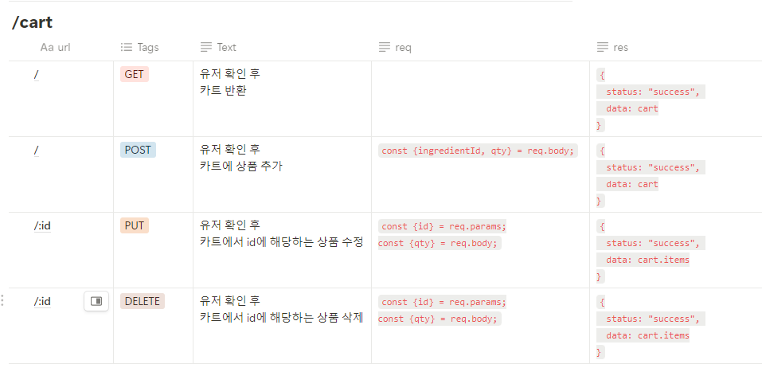
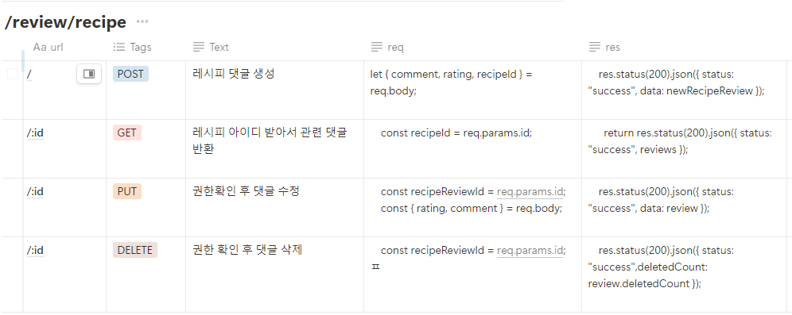
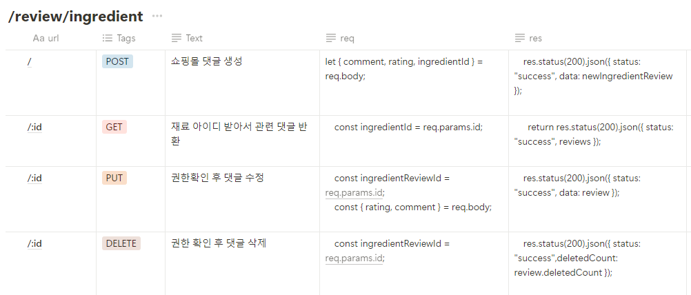
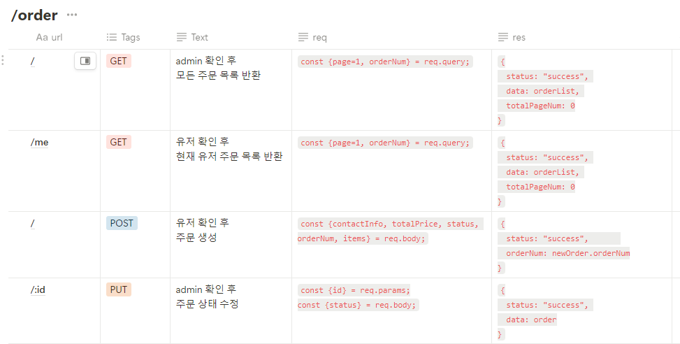

# 🍴 What’s in your fridge: A Combination of Recipes and Shopping

What’s in your fridge is a website where users can browse various recipes and easily purchase the necessary ingredients.
>
<br>

### Development Period

- Total development period: 2024-06-16 ~ 2024-06-30
- Backend implementation: 2022-06-18 ~ 2022-06-27
- Frontend and functionality implementation: 2022-06-18 ~ 2022-06-30

### Deployment Links

><div>Frontend Server: https://whats-is-your-fridge.netlify.app/</div>
>Backend Server: http://what-is-your-fridge.us-east-1.elasticbeanstalk.com/
<br>

### Test Account

- **Test ID**: admin@gmail.com
- **Test PW**: 123

## Project Introduction

**What’s in your fridge** was planned to eliminate the hassle of searching for recipes on multiple sites and separately purchasing the ingredients needed for cooking.
- Helps users easily search for cooking recipes and purchase the necessary ingredients directly,
- Through the My Fridge feature, it recommends recipes using ingredients that the user already has.
- Allows various users to rate and comment on their favorite recipes or products.
<br>

## Team Members

|Lee Jeong Woo|Jung Sung Wook|Choi Chung Hyun|Oh Hye Rim|
|:------:|:---:|:---:|:-----:|
|[@leejeongwoo1](https://github.com/leejeongwoo1/leejeongwoo1)|[@SungJung0616](https://github.com/SungJung0616)|[@zzgh06](https://github.com/zzgh06)|[@ohloara](https://github.com/ohloara)|
<br>

## Getting Started

1. Clone the repository
    ```sh
    git clone git@github.com:zzgh06/cooking-recipe-be.git
    ```
2. Install packages
    ```sh
    cd cooking-recipe-be
    npm install
    ```
3. Set environment variables
    ```
    MONGO_URI=your_mongo_uri
    JWT_SECRET=your_jwt_secret
    GOOGLE_CLIENT_ID=your_google_client_id
    GOOGLE_CLIENT_SECRET=your_google_client_secret
    ```
4. Start the local server
    ```sh
    npm run local_start
    ```
<br>

## 📚 STACKS
### Environment
 
### Config


### Development
      
### Deployment
 
<br>
<br>

## Adopted Development Technologies and Branch Strategy

**React**

- Componentized to consider future maintenance and reusability.
- With many parts being used repeatedly such as user banners, top and bottom banners, resource savings were possible through componentization.

**Redux Toolkit**

- Simplified state management by using Redux Toolkit.
- Redux Toolkit reduces boilerplate code and simplifies setup compared to traditional Redux, reducing learning costs.
- Efficiently managed state and asynchronous logic using createSlice and createAsyncThunk.

## Branch Strategy

- Operated master, develop, and feature sub-branches based on Git-flow strategy.
- The master branch is used only at the deployment stage.
- The develop branch acts as the master branch during the development phase in git-flow.
- Feature branches were used for independent development environments by function unit, and each branch was deleted after merging.

## Project Structure

### Backend

### Backend Folder Structure

[cooking-recipe-be.md](./cooking-recipe-be.txt)

### Backend ERD



### API

- 
- 
- 
- 
- 
- 
- 
- 
- 

## Frontend

### Frontend Folder Structure

[cooking-recipe-fe.md](./cooking-recipe-fe.txt)

## Screenshots

|Recipe Page|Recipe Detail Page|
|:------:|:------:|
|||

|Store Page|Store Detail Page|
|:---:|:------:|
|||

|My Fridge Page|Admin Page|
|:------:|:------:|
|||
<br>

## ⭐ Key Features 
  ### 1. Recipe Management
  - Search and write various recipes
  - View detailed recipe information
  ### 2. Ingredient Management
  - Add required ingredients to the cart
  - Purchase ingredients
  ### 3. Fridge Management
  - Manage fridge ingredients
  - Recommend recipes using ingredients in the fridge
  ### 4. Review and User Management
  - Write reviews for recipes and ingredients
  ### 5. Chatbot
  - Inquiry function
<br>

## How to Use
1. Search for the desired recipe on the homepage.
2. Click on the recipe to view detailed information.
3. Add the necessary ingredients to the cart.
4. Register the ingredients you have in My Fridge and check the recommended recipes.
5. Go to the cart page to purchase ingredients.
6. Check the order status on the My Page.
<br>
